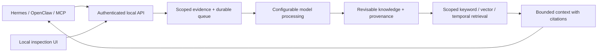

# bigfeels

**Memory that travels with your agents, and shows its work.**

bigfeels is an open-source, on-device memory service for Hermes, OpenClaw,
and MCP-capable agents. It retains evidence, tracks changing knowledge, and
retrieves scoped context without treating old memories as new permissions.

The package and command are **`bigfeels-mem`**. This repository contains the first
preview implementation. See [verification](docs/verification.md) for measured
results and the boundary between local contract tests and live host validation.

## Start locally

Requires Python 3.11 or later with SQLite FTS5. The service has no mandatory
third-party runtime dependencies. Install from this checkout; no package registry
publication is assumed:

```sh
python3 -m venv .venv
.venv/bin/python -m pip install .
.venv/bin/bigfeels-mem init
.venv/bin/bigfeels-mem pair inspector --space owner
.venv/bin/bigfeels-mem serve
```

Open `http://127.0.0.1:8765` and enter the pairing token. The browser keeps it
only in memory. Pair separate credentials for each integration. Tokens authorize
all memory operations within their assigned spaces, including deletion.

Use `--data-dir /path/to/private-directory` before the subcommand to run an
isolated instance. The CLI does not modify Hermes/OpenClaw configuration or
install a background OS service.

## Configure model processing

Storage runs locally; extraction and embeddings can use a hosted provider.
Configure an OpenAI-compatible endpoint and model identifiers you have access to:

```sh
bigfeels-mem configure \
  --base-url https://api.openai.com/v1 \
  --api-key-env OPENAI_API_KEY \
  --extraction-model YOUR_CHAT_MODEL \
  --embedding-model YOUR_EMBEDDING_MODEL \
  --allow-remote
```

Supply the key through the named environment variable when starting the service.
Configuration stores the variable name, not its value. Enabling remote processing
sends redacted evidence to the extraction provider, memory content to the embedding
provider, and recall queries for query embeddings. Redaction is best effort, not
a guarantee that arbitrary sensitive information is detected. Providers may retain
submitted content under their own policies.

Extraction requires a chat model supporting JSON-object responses. Embeddings
use the provider's `/embeddings` endpoint. A loopback compatible endpoint can be
used without `--allow-remote`; local models are optional. Restart the service
after changing configuration.

Without models, explicit saves, corrections, deletion, evidence inspection,
keyword search, and exports work. Captured interactions remain visibly queued
until extraction is configured. There is no pretend local intelligence fallback.

## Connect agents

- [Hermes native provider](adapters/hermes/README.md): lifecycle capture and recall.
- [OpenClaw native plugin](adapters/openclaw/README.md): memory tools and host hooks.
- Any MCP stdio host: configure command `bigfeels-mem`, arguments
  `["mcp"]`, and environment variable `BIGFEELS_MEM_TOKEN` with a paired token.
  The local service must already be running. MCP exposes tools; automatic capture
  requires a host lifecycle adapter.

Create explicitly linked project spaces and pair each participating host:

```sh
bigfeels-mem space project:my-app
bigfeels-mem pair hermes --space owner --space project:my-app
bigfeels-mem pair openclaw --space owner --space project:my-app
```

Configure both adapters to use the exact project space. Folder names and agent
names never silently merge memory. [Compatibility evidence](docs/compatibility.md)
identifies the upstream contracts inspected and host scenarios not yet run.

## How memory behaves

See the [design rationale](docs/design.md) for the qualities, failure modes, and
tradeoffs behind these choices.



Evidence is distinct from derived knowledge. Records carry a memory kind, source
basis, temporal validity, revision, and outcome. Unsupported inferences are
candidates and stay out of automatic context. Browse them in the inspection UI.

Automatic promotion preserves a complete bounded user/tool evidence item rather
than trusting a potentially misleading extracted substring. Longer synthesized
memories remain candidates. Model-generated success labels are not verification.
This conservative default spends more context to preserve qualifiers and negation.

Explicit corrections atomically supersede prior knowledge while preserving its
historical validity. Overlapping disagreements with a shared subject key appear
as disputed; the service does not invent a winner. Repeated evidence joins source
lineage without adding confidence votes. Learned procedures are retrievable notes,
never automatically executed code.

Retrieval checks scope before ranking. It combines keyword and optional vector
matches, historical validity, and explicit conflict links, then applies a budget.
The initial budget uses UTF-8 bytes as a conservative token upper bound; the
`tokens` value is not a provider tokenizer measurement. Empty results are valid.
Trace metadata explains matching, evidence availability, and provider outages.

## Inspect, correct, and forget

The local UI supports browsing all statuses, searching, reading evidence, viewing
recall traces, correcting with revision checks, and deleting. The versioned
[API contract](docs/CONTRACT.md) documents the same operations for agent tools.

Forgetting removes supporting evidence and dependent memories, including correction
lineage. This can remove sibling knowledge derived from the same evidence; the
UI explains that breadth. Content-free source identity tombstones prevent replay.
Maintenance purges obsolete text-index blocks and compacts the database. External
exports, backups, host transcripts, and provider copies are outside local deletion.

## Operations and development

```sh
bigfeels-mem doctor
bigfeels-mem maintenance
bigfeels-mem export --output memory-export.json
bigfeels-mem --data-dir /new/empty/directory restore memory-export.json

PYTHONPATH=src python3 -m unittest discover -s tests -v
PYTHONPATH=src python3 benchmarks/replay.py --output benchmarks/results.json
```

Export uses `BIGFEELS_MEM_TOKEN` for scoped access and excludes credentials.
To retire a credential, run `bigfeels-mem revoke --token-env BIGFEELS_MEM_TOKEN`.
Restore requires an empty database, validates scope/provenance integrity, and
restores unfinished processing. Embeddings are rebuilt using the configured model.

See [operations](docs/operations.md), [evaluation methodology](benchmarks/README.md),
and [contributing](CONTRIBUTING.md). This preview is designed for one OS user and
modest local corpora. Remote hosting, multi-device synchronization, multi-tenant
administration, and autonomous skill rewriting are outside its current scope.

Licensed under [Apache-2.0](LICENSE).
